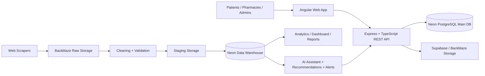

<div align="center">

# MediSearch

### Medical & Pharmacy Intelligence Platform for medicine discovery, pharmacy availability, pricing, analytics, and data-driven recommendations.

[](web_app/frontend/package.json)
[](web_app/Backend/package.json)
[](web_app/Backend/tsconfig.json)
[](infrastructure/DatabaseConfigurationGuide_Neon_MainDatabase.md)
[](web_app/Backend/prisma/schema.prisma)
[](docs/deployment/README.md)
[](infrastructure/raw_data_storage.md)
[](infrastructure/PharmacyIngestionStorage.md)

MediSearch is an end-to-end medical and pharmacy intelligence system that helps patients find medicines, compare pharmacy availability and prices, discover alternatives, and receive useful notifications while giving the project team a structured data platform for scraping, cleaning, staging, warehousing, analytics, and future AI-powered recommendations. The repository combines an Angular web client, an Express/TypeScript REST API, a PostgreSQL operational schema managed with Prisma, pharmacy/geography ingestion utilities, Backblaze/Supabase storage guidance, Neon database configuration, and a comprehensive documentation suite for architecture, SRS, APIs, infrastructure, data engineering, security, operations, testing, and release management.

**Live frontend:** <https://medi-search-eight.vercel.app/> · **Live backend:** <https://medi-search-backend.vercel.app/> · **API health:** <https://medi-search-backend.vercel.app/api/health>

</div>

---

## Table of Contents

- [About The Project](#about-the-project)
- [Key Features](#key-features)
- [Project Architecture](#project-architecture)
- [Technology Stack](#technology-stack)
- [Repository Structure](#repository-structure)
- [Documentation](#documentation)
- [Data Engineering Workflow](#data-engineering-workflow)
- [Infrastructure](#infrastructure)
- [AI Features](#ai-features)
- [Installation](#installation)
- [Environment Variables](#environment-variables)
- [Running the Project](#running-the-project)
- [Project Workflow](#project-workflow)
- [Folder Responsibilities](#folder-responsibilities)
- [Development Guidelines](#development-guidelines)
- [Contributing](#contributing)
- [Project Roadmap](#project-roadmap)
- [Team](#team)
- [License](#license)
- [Acknowledgements](#acknowledgements)

---

## About The Project

MediSearch addresses a practical healthcare access problem: patients often need to know which medicine is available, where it can be found, how much it costs, and what alternatives may exist when the target product is unavailable. Pharmacies also need structured inventory representation, while analysts and maintainers need a repeatable data lifecycle for collecting product, pharmacy, geography, and operational data.

The current implementation delivers this as a modular platform:

- **Patient-facing web application** built with Angular, routing, reusable shared components, authentication guards, API services, home/search experiences, pharmacy detail pages, favorites state, notifications, and an AI assistant UI component.
- **REST backend** built with Express and TypeScript, secured with Helmet/CORS/cookies/JWT, and organized into auth, categories, countries, governorates, cities, medicines, favorites, pharmacies, statistics, notifications, and search modules.
- **Operational database** modeled in Prisma over PostgreSQL/Neon, including users, drugs, categories, tags, alternatives, pharmacies, inventory, price/availability history, alerts, notifications, ratings, geography, search logs, and analytics tables.
- **Data engineering layer** for scraping pharmacy data, collecting geography data, cleaning/validating records, uploading pharmacy/geography data, staging outputs, and preparing warehouse/analytics workflows.
- **Infrastructure documentation** for Neon main database and warehouse, Backblaze B2 raw/staging storage, Supabase storage, Vercel deployment, and database configuration.

What makes the project different is that it is not only a web application. It is a full-stack pharmacy intelligence repository: product discovery, inventory, search, analytics, storage architecture, data lifecycle, database modeling, and future AI workflows are documented and implemented together rather than treated as separate prototypes.

---

## Key Features

| Area | Implemented / Documented Capability |
| --- | --- |
| AI Assistant | Frontend AI assistant component and AI architecture documentation for assistant and health-alert flows. |
| Drug Search | Backend `/api/search` searches medicine name, active substance, and manufacturer with pagination and availability/pricing summaries. |
| Medicine Catalog | Backend medicine/category modules expose home-page medicine and category data backed by the `drugs` and `drug_categories` models. |
| Nearby Pharmacy Search | Pharmacy pages expose active pharmacies, city/governorate metadata, pharmacy inventory, categories, reviews, and statistics. |
| Drug Alternatives | `drug_alternatives` relational model and API search response includes alternative counts for medicine records. |
| Personalized Health Alerts | `alerts` and `notifications` schema support medicine/pharmacy alerts, unread counts, welcome notifications, read/delete flows, and AI alert documentation. |
| Price Comparison | Inventory and price-history tables track pharmacy-specific medicine prices; search responses return minimum price across inventory records. |
| Pharmacy Inventory | `pharmacy_inventory` links pharmacies to drugs with quantity, minimum stock, price, and last update timestamps. |
| Recommendation Engine | AI documentation and diagrams define recommendation-engine workflows; schema supports favorites, search logs, alternatives, and analytics inputs. |
| Analytics | `drug_analytics`, `search_logs`, statistics endpoint, analytics docs, reports folders, and dashboard data-flow documentation support BI use cases. |
| Data Warehouse | Warehouse docs and diagrams define warehouse loading, star-schema concepts, fact/dimension relationships, and Neon warehouse configuration. |
| ETL Pipelines | Cleaning, scraping, transform, combine, upload, and staging documentation define raw-to-warehouse processing responsibilities. |
| Business Intelligence | Dashboard and analytics documentation describe reporting and KPI data flow over staged/warehouse data. |
| Web Scraping | Chefaa, Bloom Pharmacy, Gardenia Pharmacies, Aldawaa Egypt, and geography scrapers collect pharmacy product and location datasets. |
| Authentication | JWT in HTTP-only cookies with register, login, profile, logout, guest guards, and protected backend middleware. |
| Favorites | Protected favorites module and frontend favorite state/services support saved medicines. |
| Notifications | Protected notifications API supports listing, unread counts, mark-as-read, mark-all, delete one, and delete all. |

---

## Project Architecture

MediSearch follows a layered architecture:



For deeper architecture details, use the dedicated documentation instead of duplicating it here:

- [Architecture overview](docs/architecture/README.md)
- [System architecture](docs/architecture/system/README.md)
- [API architecture](docs/architecture/api/README.md)
- [AI architecture](docs/architecture/ai/README.md)
- [Pipeline architecture](docs/architecture/pipelines/README.md)
- [Warehouse architecture](docs/architecture/warehouse/README.md)
- [Infrastructure architecture](docs/architecture/infrastructure/README.md)
- [Deployment architecture](docs/architecture/deployment/README.md)
- [Mermaid diagrams](docs/diagrams/README.md), including [high-level architecture](docs/diagrams/architecture/high_level_architecture.mmd), [component architecture](docs/diagrams/architecture/component_architecture.mmd), [ETL pipeline](docs/diagrams/pipelines/etl_pipeline.mmd), [storage architecture](docs/diagrams/infrastructure/storage_architecture.mmd), and [star schema overview](docs/diagrams/warehouse/star_schema_overview.mmd).

---

## Technology Stack

| Layer | Technologies | Repository Evidence |
| --- | --- | --- |
| Frontend | Angular 21, TypeScript, Angular Router, Reactive/Template Forms, RxJS, Angular CLI/Vitest | [`web_app/frontend`](web_app/frontend), [`package.json`](web_app/frontend/package.json) |
| Backend | Node.js, Express 5, TypeScript, REST APIs, Helmet, CORS, cookie-parser | [`web_app/Backend`](web_app/Backend), [`src/app.ts`](web_app/Backend/src/app.ts) |
| Authentication | JWT, HTTP-only cookies, bcryptjs, route guards | [`auth` module](web_app/Backend/src/modules/auth), [`auth.middleware.ts`](web_app/Backend/src/middleware/auth.middleware.ts) |
| Databases | PostgreSQL on Neon, Prisma ORM, operational schema PDFs | [`schema.prisma`](web_app/Backend/prisma/schema.prisma), [`database/schema`](database/schema) |
| Data Engineering | Python, pandas, psycopg2, scraping scripts, cleaning/upload pipelines | [`pipelines/cleaning`](pipelines/cleaning), [`web_scaping`](web_scaping) |
| Cloud | Neon, Vercel, Backblaze B2, Supabase | [`infrastructure`](infrastructure), [`docs/deployment`](docs/deployment) |
| Storage | Backblaze B2 raw/staging storage, Supabase pharmacy ingestion/media storage | [`data/raw/README.md`](data/raw/README.md), [`infrastructure/staging_storage.md`](infrastructure/staging_storage.md) |
| AI | AI assistant UX, recommendation workflow docs, alternatives, alerts, analytics inputs | [`docs/ai`](docs/ai), [`docs/diagrams/ai`](docs/diagrams/ai), [`ai-assistan` component](web_app/frontend/src/app/components/ai-assistan) |
| Deployment | Vercel frontend/backend deployment, serverless backend config | [`web_app/Backend/vercel.json`](web_app/Backend/vercel.json), [`docs/deployment`](docs/deployment) |
| Analytics | Drug analytics schema, search logs, dashboard docs, reports/notebooks folders | [`analytics`](analytics), [`docs/data_engineering/analytics`](docs/data_engineering/analytics), [`docs/diagrams/analytics`](docs/diagrams/analytics) |

---

## Repository Structure

```text
.
├── README.md                  # Primary project entry point
├── docs/                      # SRS, architecture, API, database, deployment, security, operations, testing, release docs
├── web_app/                   # Angular frontend, Express backend, UI/UX design documentation
├── web_scaping/               # Pharmacy product scraping modules and scraper datasets documentation
├── pipelines/                 # Data ingestion/cleaning/processing/loading pipeline folders
├── data/                      # Raw, staging, and warehouse data-zone documentation and sample/raw data layout
├── database/                  # Main database schema PDFs, migrations, and seed placeholders
├── infrastructure/            # Neon, Backblaze B2, Supabase, staging, and ingestion storage guides
├── analytics/                 # Notebook/report/model placeholders for analytics and ML experiments
├── dashboard/                 # Dashboard/BI placeholder
└── tests/                     # Test placeholder for future cross-project test suites
```

---

## Documentation

| Documentation Area | Purpose | Description |
| --- | --- | --- |
| [docs](docs/README.md) | Central documentation hub | Indexes all major project documentation and recommended reading path. |
| [SRS](docs/srs/README.md) | Requirements | Software requirements, stakeholders, features, and data-pipeline requirements. |
| [Architecture](docs/architecture/README.md) | System design | System, API, AI, deployment, infrastructure, pipelines, and warehouse architecture. |
| [Diagrams](docs/diagrams/README.md) | Visual design | Mermaid architecture, API, backend, frontend, database, infrastructure, pipelines, analytics, AI, and warehouse diagrams. |
| [API](docs/api/README.md) | Integration contract | REST endpoint overview and detailed [API reference](docs/api/API_REFERENCE.md). |
| [Backend](docs/backend/README.md) | Server-side implementation | Express/TypeScript backend structure and request lifecycle. |
| [Frontend](docs/frontend/README.md) | Client implementation | Angular structure, routes, components, services, and state. |
| [Database](docs/database/README.md) | Persistence | Main operational database, shared lifecycle docs, warehouse docs, and reference material. |
| [Data Engineering](docs/data_engineering/README.md) | Data lifecycle | Cleaning, ETL, pipeline, warehouse, and analytics documentation. |
| [Deployment](docs/deployment/README.md) | Release hosting | Deployment process and database configuration. |
| [Configuration](docs/configuration/README.md) | Environment setup | Environment and configuration guidance. |
| [Infrastructure](infrastructure/README.md) | Cloud services | Neon, Backblaze, Supabase, raw/staging/pharmacy ingestion storage guides. |
| [Security](docs/security/README.md) | Protection model | Authentication, authorization, data protection, and hardening guidance. |
| [Operations](docs/operations/README.md) | Runtime support | Monitoring, troubleshooting, backup, and runbook documentation. |
| [Testing](docs/testing/README.md) | Quality strategy | Test strategy and release verification guidance. |
| [Development](docs/development/README.md) | Contributor workflow | Local development, standards, and contribution practices. |
| [Release](docs/release/README.md) | Release management | Release checklist, changelog template, and release notes template. |
| [Reports](docs/reports/README.md) | Project outputs | Reports and progress artifacts. |
| [Presentation](docs/presentation/README.md) | Stakeholder material | Presentation and demo notes. |
| [References](docs/references/README.md) | Supporting references | Team and supplemental reference material. |

<details>
<summary><strong>Important implementation READMEs outside <code>docs/</code></strong></summary>

| Path | Purpose |
| --- | --- |
| [web_app/README.md](web_app/README.md) | Web application overview, live demo, and main frontend features. |
| [web_app/Backend/README.md](web_app/Backend/README.md) | Backend application overview, live API, stack, and responsibilities. |
| [web_app/frontend/README.md](web_app/frontend/README.md) | Angular CLI commands for local frontend development. |
| [web_app/UI_UX/README.md](web_app/UI_UX/README.md) | UI/UX goals, users, information architecture, and Figma reference. |
| [data/raw/README.md](data/raw/README.md) | Backblaze B2 raw data storage overview. |
| [data/staging/README.md](data/staging/README.md) | Cleaning module and staging storage flow. |
| [pipelines/cleaning/README.md](pipelines/cleaning/README.md) | Cleaning pipeline responsibilities. |
| [web_scaping/README.md](web_scaping/README.md) | Chefaa scraper design and output schema. |
| [web_scaping/Gardenia/README.md](web_scaping/Gardenia/README.md) | Gardenia Pharmacies scraper dataset summary. |
| [web_scaping/aldawaaegy/README.md](web_scaping/aldawaaegy/README.md) | Aldawaa Egypt scraper dataset summary. |
| [web_scaping/bloom code/Readme.md](web_scaping/bloom%20code/Readme.md) | Bloom Pharmacy scraper variants and usage. |

</details>

---

## Data Engineering Workflow

MediSearch uses a staged data lifecycle so raw external data can become trusted operational, analytical, and AI-ready assets.

| Stage | Repository Location | Responsibility |
| --- | --- | --- |
| Raw | [`data/raw`](data/raw), [`infrastructure/raw_data_storage.md`](infrastructure/raw_data_storage.md) | Store original scraped/API/historical files in Backblaze B2 without destructive transformation. |
| Collection | [`web_scaping`](web_scaping), [`pipelines/cleaning/Scraping`](pipelines/cleaning/Scraping) | Scrape pharmacy product catalogs and geography datasets from sources such as Chefaa, Gardenia, Aldawaa, Bloom, Egypt cities, and Saudi cities. |
| Cleaning | [`pipelines/cleaning`](pipelines/cleaning), [`data/staging/README.md`](data/staging/README.md) | Remove duplicates, handle missing values, standardize columns/text/types, validate data integrity, and prepare records for staging. |
| Staging | [`data/staging`](data/staging), [`infrastructure/staging_storage.md`](infrastructure/staging_storage.md) | Store cleaned and partially processed datasets before loading. |
| Transformation | [`pipelines/cleaning/Transform`](pipelines/cleaning/Transform), [`pipelines/cleaning/Combine`](pipelines/cleaning/Combine) | Normalize, combine, and map source-specific data into database/warehouse-ready structures. |
| Loading | [`pipelines/cleaning/Uploading`](pipelines/cleaning/Uploading), [`pipelines/loading`](pipelines/loading) | Upload pharmacy and geography records into PostgreSQL using psycopg2/pandas scripts and conflict-safe inserts where documented. |
| Warehouse | [`docs/data_engineering/warehouse`](docs/data_engineering/warehouse), [`docs/database/data_warehouse`](docs/database/data_warehouse) | Model analytics-ready fact/dimension structures and loading flows in the data warehouse. |
| Analytics | [`analytics`](analytics), [`docs/data_engineering/analytics`](docs/data_engineering/analytics), [`dashboard`](dashboard) | Produce KPIs, reports, dashboards, and BI-ready outputs. |
| AI | [`docs/ai`](docs/ai), [`docs/diagrams/ai`](docs/diagrams/ai) | Feed assistant, recommendation, alternative, alert, and future model workflows with curated operational and analytical data. |

```text
Raw Storage → Cleaning / Validation → Staging Storage → Transformation → Operational DB / Warehouse → Analytics → AI Features
```

---

## Infrastructure

| Service | Role in MediSearch | Documentation |
| --- | --- | --- |
| Neon Main Database | Hosts the operational PostgreSQL database used by the backend and Prisma schema. | [Main database guide](infrastructure/DatabaseConfigurationGuide_Neon_MainDatabase.md), [database docs](docs/database/main_database/README.md) |
| Neon Data Warehouse | Hosts analytics/warehouse structures for fact/dimension modeling and BI workloads. | [Warehouse database guide](infrastructure/DatabaseConfigurationGuide_Neon_DataWarehouse.md), [warehouse docs](docs/database/data_warehouse/README.md) |
| Backblaze B2 | Stores raw and historical datasets, large files, logs, pharmacy exports, and AI training datasets outside GitHub. | [Raw storage](infrastructure/raw_data_storage.md), [data/raw](data/raw/README.md) |
| Backblaze/Staging Storage | Stores cleaned and staged datasets between cleaning and warehouse loading. | [Staging storage](infrastructure/staging_storage.md) |
| Supabase Storage | Stores pharmacy ingestion/media assets where documented by the ingestion storage guide. | [Pharmacy ingestion storage](infrastructure/PharmacyIngestionStorage.md) |
| Vercel | Hosts the Angular frontend and Express backend/serverless deployment. | [Deployment docs](docs/deployment/README.md), [backend Vercel config](web_app/Backend/vercel.json) |

---

## AI Features

MediSearch includes implemented UI/schema foundations and architecture documentation for AI-enabled workflows:

| Feature | Current Repository Support |
| --- | --- |
| AI Assistant | Angular `ai-assistan` component plus AI assistant/health-alert flow diagram and AI documentation. |
| Recommendation Engine | Recommendation workflow documentation and diagram; future inputs include favorites, search logs, inventory, categories, alternatives, and analytics. |
| Alternative Recommendation | `drug_alternatives` schema links medicines to alternatives; search responses expose `alternatives_count`. |
| Health Alerts | `alerts` schema, user notifications module, unread counts, read/delete APIs, and AI health-alert documentation support alert delivery. |

See [AI documentation](docs/ai/README.md), [AI architecture](docs/architecture/ai/README.md), [AI assistant health-alert flow](docs/diagrams/ai/ai_assistant_health_alert_flow.mmd), and [recommendation workflow](docs/diagrams/ai/recommendation_engine_workflow.mmd).

---

## Installation

### 1. Clone the repository

```bash
git clone https://github.com/hossam-mohamed-abd/TheSilence_DEPI.git
cd TheSilence_DEPI
```

### 2. Install backend dependencies

```bash
cd web_app/Backend
npm install
```

### 3. Install frontend dependencies

```bash
cd ../frontend
npm install
```

### 4. Prepare Python tooling for pipelines and scrapers

There is no single root Python dependency file. Install dependencies per scraper/pipeline module based on the script imports and module README files. Common packages used by the documented data workflows include:

```bash
python -m pip install pandas psycopg2-binary requests beautifulsoup4 lxml boto3
```

For scraper-specific guidance, read [web_scaping/README.md](web_scaping/README.md), [Bloom scraper README](web_scaping/bloom%20code/Readme.md), [Gardenia README](web_scaping/Gardenia/README.md), and [Aldawaa README](web_scaping/aldawaaegy/README.md).

---

## Environment Variables

Do **not** commit secrets. Use local `.env` files and deployment-provider secret stores.

### Backend: `web_app/Backend/.env`

| Variable | Required | Purpose |
| --- | --- | --- |
| `DATABASE_URL` | Yes | PostgreSQL/Neon connection string consumed by Prisma. |
| `JWT_SECRET` | Yes | Secret key used to sign and verify JWT cookies. |
| `PORT` | No | Local API port; defaults to `3000`. |
| `NODE_ENV` | No | Controls production cookie security behavior. |

### Frontend environments

| File | Purpose |
| --- | --- |
| [`web_app/frontend/src/environments/environment.ts`](web_app/frontend/src/environments/environment.ts) | Local API URL, currently `http://localhost:3000/api`. |
| [`web_app/frontend/src/environments/environment.prod.ts`](web_app/frontend/src/environments/environment.prod.ts) | Production API URL, currently `https://medi-search-backend.vercel.app/api`. |

### Infrastructure and pipelines

Storage/database scripts may require service-specific credentials for Neon, Backblaze B2, and Supabase. Follow the relevant infrastructure documents and keep keys in local environment files or cloud secret managers:

- [Neon main database guide](infrastructure/DatabaseConfigurationGuide_Neon_MainDatabase.md)
- [Neon warehouse guide](infrastructure/DatabaseConfigurationGuide_Neon_DataWarehouse.md)
- [Raw Backblaze storage](infrastructure/raw_data_storage.md)
- [Staging storage](infrastructure/staging_storage.md)
- [Pharmacy ingestion storage](infrastructure/PharmacyIngestionStorage.md)

---

## Running the Project

### Backend API

```bash
cd web_app/Backend
npm run dev
```

Default local endpoints:

- Root: <http://localhost:3000/>
- Health: <http://localhost:3000/api/health>
- API base: <http://localhost:3000/api>

### Frontend web app

```bash
cd web_app/frontend
npm start
```

Open <http://localhost:4200/>.

### Pipelines and scrapers

Run only the pipeline needed for your task and read the local README first. Examples:

```bash
python "pipelines/cleaning/Scraping/Scraping Egypt cities.py"
python "pipelines/cleaning/Scraping/Scraping Saudi cities.py"
python "pipelines/cleaning/Uploading/Pharmacy_data/upload_gardenia.py"
```

For Bloom scraper usage:

```bash
cd "web_scaping/bloom code"
python bloom_pharmacy_complete_scraper.py
```

### Warehouse

Warehouse implementation is documented through architecture/database/data-engineering guides. Start with:

- [Warehouse architecture](docs/architecture/warehouse/README.md)
- [Data warehouse docs](docs/database/data_warehouse/README.md)
- [Data engineering warehouse docs](docs/data_engineering/warehouse/README.md)
- [Neon warehouse configuration](infrastructure/DatabaseConfigurationGuide_Neon_DataWarehouse.md)

---

## Project Workflow

1. **Define requirements** in [SRS](docs/srs/README.md) and feature/stakeholder docs.
2. **Design architecture** in [docs/architecture](docs/architecture/README.md) and [docs/diagrams](docs/diagrams/README.md).
3. **Collect data** through web scraping and geography collection modules.
4. **Store raw data** in Backblaze B2 using infrastructure guidance.
5. **Clean and validate data** in pipeline modules.
6. **Stage transformed data** in staging storage.
7. **Load operational data** into Neon PostgreSQL for the backend.
8. **Model warehouse data** for analytics and BI.
9. **Develop backend APIs** in feature modules under `web_app/Backend/src/modules`.
10. **Develop frontend features** in Angular components/services under `web_app/frontend/src/app`.
11. **Document changes** in the most specific `docs/` folder and local module README.
12. **Verify and release** using testing, operations, and release documentation.

---

## Folder Responsibilities

| Folder | Responsibility |
| --- | --- |
| [`docs/`](docs) | Authoritative project documentation hub. |
| [`docs/srs/`](docs/srs) | Requirements, stakeholders, feature definitions, and SRS PDFs. |
| [`docs/architecture/`](docs/architecture) | Architectural decisions and subsystem design. |
| [`docs/diagrams/`](docs/diagrams) | Mermaid diagrams for architecture, API, backend, frontend, infrastructure, database, pipelines, warehouse, analytics, security, and AI. |
| [`docs/api/`](docs/api) | REST API reference and endpoint contracts. |
| [`docs/backend/`](docs/backend) | Backend design, structure, and request lifecycle. |
| [`docs/frontend/`](docs/frontend) | Frontend design, routing, components, services, and state documentation. |
| [`docs/database/`](docs/database) | Main database, warehouse, shared lifecycle, and reference docs. |
| [`docs/data_engineering/`](docs/data_engineering) | Data lifecycle, cleaning, ETL, pipeline, warehouse, and analytics docs. |
| [`web_app/Backend/`](web_app/Backend) | Express/TypeScript API, Prisma schema, auth, search, pharmacy, favorite, notification, geography, medicine, statistics modules. |
| [`web_app/frontend/`](web_app/frontend) | Angular application, routes, components, guards, models, services, environments, and public assets. |
| [`web_app/UI_UX/`](web_app/UI_UX) | Figma/UX documentation and design system. |
| [`web_scaping/`](web_scaping) | Pharmacy web scrapers and scraped dataset documentation. |
| [`pipelines/`](pipelines) | Data ingestion, cleaning, processing, loading, transformation, combining, scraping, and upload workflows. |
| [`data/`](data) | Data-zone documentation and raw/staging/warehouse directory structure. |
| [`database/`](database) | Database schema PDFs plus migration and seed placeholders. |
| [`infrastructure/`](infrastructure) | Cloud database/storage configuration guides. |
| [`analytics/`](analytics) | Analytics notebooks, reports, and model placeholders. |
| [`dashboard/`](dashboard) | BI/dashboard placeholder. |
| [`tests/`](tests) | Cross-project test placeholder. |

---

## Development Guidelines

### Coding Standards

- Keep backend features modular: route → controller → service → repository.
- Keep frontend logic separated into components, services, models, guards, and environment files.
- Prefer strongly typed TypeScript interfaces/models for API payloads.
- Do not hard-code secrets or production credentials.
- Keep generated/build artifacts separate from source changes where possible.
- Update docs when behavior, schema, deployment, or pipeline logic changes.

### Naming Conventions

| Area | Convention |
| --- | --- |
| Backend modules | `*.routes.ts`, `*.controller.ts`, `*.service.ts`, `*.repository.ts`, `*.types.ts` where applicable. |
| Angular components | `feature-name.component.ts/html/css`. |
| Angular services | `feature.service.ts` or state-specific `feature-state.service.ts`. |
| Documentation | Descriptive Markdown files in the most specific documentation folder. |
| Pipeline scripts | Clear action/source names such as `upload_gardenia.py` or `Scraping Egypt cities.py`; prefer future normalization to snake_case. |

### Documentation Standards

- Preserve existing documentation structure: overview, purpose, contents, related docs, and notes where applicable.
- Reference canonical docs instead of duplicating large sections.
- Add diagrams to `docs/diagrams` when architecture or flow changes.
- Keep README files accurate to implementation, not aspiration.
- Include setup, required environment variables, and run commands for new modules.

---

## Contributing

Contributions should improve implementation, documentation, data quality, or developer experience while keeping the platform consistent.

1. Create a focused branch.
2. Read the relevant local README and docs before editing.
3. Make small, reviewable changes.
4. Update documentation and diagrams when behavior changes.
5. Run the relevant checks:
   - Backend: `npm run build` from `web_app/Backend`.
   - Frontend: `npm run build` and relevant tests from `web_app/frontend`.
   - Pipelines: run the specific script in a safe/dev environment with test credentials or sample data.
6. Do not commit secrets, local `.env` files, raw credentials, or large generated files unless explicitly approved.
7. Open a pull request with a concise summary, testing notes, data/schema impacts, and screenshots for visible UI changes.

---

## Project Roadmap

### Current Implementation

- Angular web application with home, auth, search overlay/shared UI, pharmacy details, favorite state, notifications services, and AI assistant UI component.
- Express/TypeScript backend with REST APIs for auth, geography, categories, medicines, favorites, pharmacies, statistics, notifications, and search.
- Prisma PostgreSQL schema for operational pharmacy intelligence data.
- Vercel deployment configuration and production frontend/backend URLs.
- Pharmacy and geography scraping/cleaning/upload scripts.
- Backblaze, Supabase, Neon, warehouse, and deployment documentation.
- Comprehensive docs for requirements, architecture, data engineering, database, API, security, operations, testing, and release.

### Future Improvements

- Complete production-grade recommendation engine implementation and evaluation workflow.
- Add full AI assistant backend orchestration and model/provider integration.
- Expand alternative recommendation from schema support to ranked API responses.
- Implement real-time pharmacy inventory and price synchronization strategy.
- Add warehouse loading automation and scheduled ETL orchestration.
- Build BI dashboards over warehouse facts/dimensions.
- Add complete backend and frontend automated test coverage in CI.
- Normalize pipeline script naming and centralize Python dependency management.
- Add role-based admin/pharmacy portals for inventory management.
- Strengthen observability, logging, monitoring, and backup automation.

---

## Team

MediSearch is organized around cross-functional responsibilities:

| Responsibility | Scope |
| --- | --- |
| Product / Stakeholders | Problem definition, SRS, feature priorities, acceptance criteria. |
| Frontend | Angular UI, routing, state, components, responsive UX, integration with backend APIs. |
| Backend | Express API, authentication, business logic, Prisma data access, deployment readiness. |
| Data Engineering | Scraping, raw/staging storage, cleaning, validation, transformation, loading, warehouse preparation. |
| Database / Infrastructure | Neon main database, Neon warehouse, Supabase/Backblaze storage, schema design, deployment configuration. |
| AI / Analytics | Recommendation concepts, assistant/alert workflows, analytics models, KPI/reporting foundations. |
| QA / Operations | Testing strategy, release verification, monitoring, troubleshooting, and operational documentation. |

See [team references](docs/references/team/README.md) and [stakeholder documentation](docs/srs/stakeholders/README.md) for supporting details.

---

## License

The backend package currently declares the `ISC` license in [`web_app/Backend/package.json`](web_app/Backend/package.json). No root `LICENSE` file is present in this repository at the time this README was written. Before external distribution, add a root `LICENSE` file and align all package metadata with the selected project license.

---

## Acknowledgements

- DEPI / TheSilence project team for requirements, implementation, documentation, data collection, and architecture work.
- Open-source communities behind Angular, Express, TypeScript, Prisma, PostgreSQL, Python, pandas, Beautiful Soup, and related tooling.
- Cloud platforms used by the project: Vercel, Neon, Backblaze B2, and Supabase.
- Public pharmacy/product/geography sources used for educational data engineering workflows, as documented in each scraper module.
