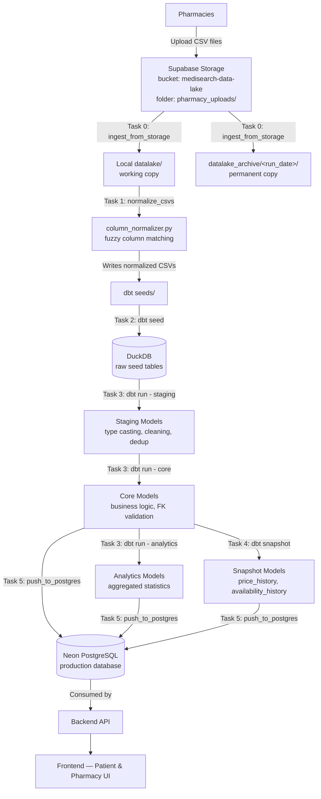
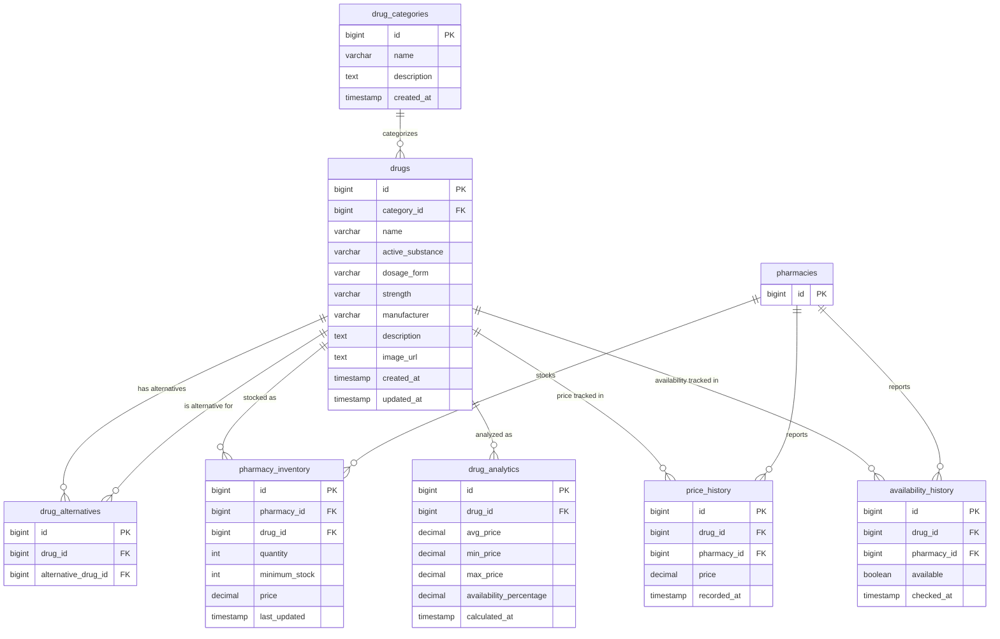
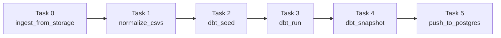

# Drug Tracking System — Data Pipeline Documentation

**Project:** Drug Tracking System
**Team:** TheSilence_DEPI
**Component:** Data Engineering Pipeline
**Repository:** `github.com/hossam-mohamed-abd/TheSilence_DEPI`

---

## Table of Contents

1. [Project Overview](#1-project-overview)
2. [Architecture & Data Flow](#2-architecture--data-flow)
3. [Database Schema (ERD)](#3-database-schema-erd)
4. [Environment Setup](#4-environment-setup)
5. [Component Reference](#5-component-reference)
6. [Pipeline Execution Order](#6-pipeline-execution-order)
7. [Data Contracts & Assumptions](#7-data-contracts--assumptions)
8. [Configuration & Secrets](#8-configuration--secrets)
9. [Known Issues & Resolved Bugs](#9-known-issues--resolved-bugs)
10. [Migration History](#10-migration-history)
11. [Deployment](#11-deployment)
12. [Glossary & FR Reference](#12-glossary--fr-reference)

---

## 1. Project Overview

### 1.1 Purpose

The Drug Tracking System helps patients find available drugs and nearby pharmacies with up-to-date pricing and availability information. Pharmacies across the network continuously report their stock levels and prices; the system aggregates this data so that a patient searching for a specific drug can see which pharmacies currently carry it, at what price, and whether cheaper or more available alternatives exist.

### 1.2 Team Structure

The project is divided by role across the following functions:

| Role | Responsibility |
|---|---|
| **Web Developer** | Builds the patient-facing frontend and pharmacy-facing interfaces |
| **Data Engineer** | Designs and builds the data pipeline (this documentation covers this role's work) |
| **Web Scrapers** | Collect supplementary drug and pricing data from external sources |
| **Data Wrangler** | Prepares and cleans raw data feeding into the pipeline |
| **Dashboard / Analytics Table Designers** | Design the analytics views and dashboards consumed by pharmacists and administrators |
| **Backend Developer** | Builds and maintains the API layer, the `pharmacies` and `users` tables, and the middleware storage layer |

This documentation covers the **Data Engineering** component: the pipeline responsible for ingesting pharmacy-submitted data, transforming it, and delivering clean, query-ready tables to the production database.

### 1.3 Scope of This Component

The data pipeline owns exactly seven tables in the shared database:

- `drug_categories`
- `drugs`
- `drug_alternatives`
- `pharmacy_inventory`
- `drug_analytics`
- `price_history`
- `availability_history`

All other tables in the system (`users`, `pharmacies`, `drug_tags`, `favorites`, `search_logs`, `notifications`, `pharmacy_ratings`, `pharmacy_staff`, `demand_logs`, `alerts`, `countries`, `governorates`, `cities`) are owned and maintained by other teams. The pipeline references `pharmacies.id` and `drugs.id`/`drug_categories.id` as foreign keys but does not create, modify, or manage those external tables.

---

## 2. Architecture & Data Flow

### 2.1 High-Level Flow



### 2.2 Why Each Layer Exists

| Layer | Purpose |
|---|---|
| **Supabase Storage** | Middleware drop-off point where the backend team places pharmacy-uploaded files. Acts as a mailbox, not permanent storage. |
| **`datalake/`** | Local working copy for the current pipeline run. Cleaned after every successful run. |
| **`datalake_archive/`** | Permanent historical record of every file ever processed, organized by the date the pipeline processed it. Grows forever by design. |
| **Column Normalizer** | Standardizes inconsistent column names from different pharmacy CSV formats using exact and fuzzy matching. |
| **dbt Seeds** | Loads normalized CSVs into DuckDB as raw tables, ready for transformation. |
| **Staging Models** | Type-cast, clean, and deduplicate raw seed data. No business logic — just data hygiene. |
| **Core Models** | Apply business logic: FK validation, ID resolution, final table shape. This is what gets pushed to production. |
| **Analytics Models** | Aggregate core data into summary statistics (average price, availability percentage) for fast patient-facing queries. |
| **Snapshot Models** | Track how data changes over time (price changes, availability changes) using dbt's SCD Type 2 mechanism. |
| **Neon PostgreSQL** | Production warehouse. The backend API reads from here to serve the frontend. |

### 2.3 Why DuckDB as an Intermediate Layer

DuckDB serves as a fast, local, file-based transformation engine. Rather than running complex SQL transformations directly against the production PostgreSQL database (which would add load and risk to production), dbt transforms the data locally in DuckDB first. Only the final, validated tables are pushed to PostgreSQL.

---

## 3. Database Schema (ERD)

### 3.1 Entity-Relationship Diagram (Owned Tables)



> `pharmacies` is shown only for FK context — it is owned and maintained by the backend team, not this pipeline.

### 3.2 Table-by-Table Reference

#### `drug_categories`
Master list of drug classification categories (e.g. Antibiotics, Analgesics).

| Column | Type | Constraints | Notes |
|---|---|---|---|
| `id` | BIGSERIAL | PK | |
| `name` | VARCHAR(100) | NOT NULL, UNIQUE | |
| `description` | TEXT | nullable | Free-text therapeutic scope |
| `created_at` | TIMESTAMP | nullable | |

#### `drugs`
Master drug reference table — the central catalogue for all known drugs.

| Column | Type | Constraints | Notes |
|---|---|---|---|
| `id` | BIGSERIAL | PK | |
| `name` | VARCHAR(255) | NOT NULL, UNIQUE | Trade/brand name |
| `active_substance` | VARCHAR(255) | nullable | Active pharmaceutical ingredient |
| `category_id` | BIGINT | FK → `drug_categories(id)` | |
| `dosage_form` | VARCHAR(255) | nullable | e.g. Tablet, Capsule |
| `strength` | VARCHAR(100) | nullable | e.g. 500mg |
| `manufacturer` | VARCHAR(255) | nullable | |
| `description` | TEXT | nullable | |
| `image_url` | TEXT | nullable | |
| `created_at` | TIMESTAMP | nullable | |
| `updated_at` | TIMESTAMP | nullable | |

`drugs.csv`, maintained by the data team, is the single source of truth for this table. There is no auto-cataloguing mechanism for unknown drugs — see [Section 7](#7-data-contracts--assumptions).

#### `drug_alternatives`
Many-to-many mapping of therapeutic drug substitutes.

| Column | Type | Constraints | Notes |
|---|---|---|---|
| `id` | BIGSERIAL | PK | |
| `drug_id` | BIGINT | NOT NULL, FK → `drugs(id)` | |
| `alternative_drug_id` | BIGINT | NOT NULL, FK → `drugs(id)` | |
| — | — | UNIQUE(`drug_id`, `alternative_drug_id`) | No duplicate pairs |
| — | — | CHECK(`drug_id` != `alternative_drug_id`) | No self-references |

#### `pharmacy_inventory`
Current stock, pricing, and quantity per pharmacy per drug. The most frequently updated table — refreshed every pipeline run.

| Column | Type | Constraints | Notes |
|---|---|---|---|
| `id` | BIGSERIAL | PK | Auto-generated by PostgreSQL — see [Section 9](#9-known-issues--resolved-bugs) |
| `pharmacy_id` | BIGINT | NOT NULL, FK → `pharmacies(id)` | Owned by backend team |
| `drug_id` | BIGINT | NOT NULL, FK → `drugs(id)` | |
| `quantity` | INT | NOT NULL, DEFAULT 0, CHECK ≥ 0 | Drives availability: `quantity > 0` |
| `minimum_stock` | INT | NOT NULL, DEFAULT 0, CHECK ≥ 0 | Low-stock alert threshold |
| `price` | NUMERIC(10,2) | NOT NULL, CHECK ≥ 0 | |
| `last_updated` | TIMESTAMP | NOT NULL, DEFAULT NOW | |
| — | — | UNIQUE(`pharmacy_id`, `drug_id`) | One record per pharmacy/drug pair |

**Important:** this table has no `available` boolean column. Availability is always derived as `quantity > 0` wherever needed downstream.

#### `drug_analytics`
Aggregated price and availability statistics per drug, computed across all pharmacies carrying it.

| Column | Type | Constraints | Notes |
|---|---|---|---|
| `id` | BIGSERIAL | PK | |
| `drug_id` | BIGINT | NOT NULL, UNIQUE, FK → `drugs(id)` | One record per drug |
| `avg_price` | NUMERIC(10,2) | nullable | |
| `min_price` | NUMERIC(10,2) | nullable | |
| `max_price` | NUMERIC(10,2) | nullable | |
| `availability_percentage` | NUMERIC(5,2) | CHECK 0–100 | % of pharmacies with `quantity > 0` |
| `calculated_at` | TIMESTAMP | NOT NULL, DEFAULT NOW | |

#### `price_history`
Append-only historical record of price changes, populated by a dbt snapshot.

| Column | Type | Constraints | Notes |
|---|---|---|---|
| `id` | BIGSERIAL | PK | |
| `drug_id` | BIGINT | NOT NULL, FK → `drugs(id)` | |
| `pharmacy_id` | BIGINT | NOT NULL | |
| `price` | NUMERIC(10,2) | NOT NULL, CHECK ≥ 0 | |
| `recorded_at` | TIMESTAMP | NOT NULL, DEFAULT NOW | |

#### `availability_history`
Append-only historical record of availability changes, populated by a dbt snapshot.

| Column | Type | Constraints | Notes |
|---|---|---|---|
| `id` | BIGSERIAL | PK | |
| `drug_id` | BIGINT | NOT NULL, FK → `drugs(id)` | |
| `pharmacy_id` | BIGINT | NOT NULL | |
| `available` | BOOLEAN | NOT NULL | Derived as `quantity > 0` |
| `checked_at` | TIMESTAMP | NOT NULL, DEFAULT NOW | |

### 3.3 Indexes

| Index | Table | Purpose |
|---|---|---|
| `idx_drugs_name` | `drugs(name)` | Fast name lookups |
| `idx_drugs_category` | `drugs(category_id)` | Category filtering |
| `idx_pharmacy_inventory_pharmacy` | `pharmacy_inventory(pharmacy_id)` | Per-pharmacy queries |
| `idx_pharmacy_inventory_drug` | `pharmacy_inventory(drug_id)` | Per-drug queries |
| `idx_pharmacy_inventory_in_stock` | `pharmacy_inventory(drug_id, pharmacy_id) WHERE quantity > 0` | Partial index for availability queries |
| `idx_price_history_drug` / `_pharmacy` | `price_history` | History lookups |
| `idx_availability_history_drug` / `_pharmacy` | `availability_history` | History lookups |
| `idx_drug_analytics_drug` | `drug_analytics(drug_id)` | Analytics lookups |

---

## 4. Environment Setup

### 4.1 Two Isolated Virtual Environments

The pipeline requires **two separate Python virtual environments** to avoid dependency conflicts:

| Environment | Location | Python Version | Purpose |
|---|---|---|---|
| `dbt_env` | `Medical_System_Pipeline/dbt_env` | 3.12 | dbt-core, dbt-duckdb, DuckDB |
| `airflow_env` | `Medical_System_Pipeline/airflow_env` | 3.10 | Apache Airflow, orchestration, storage ingestion |

**Why separate:** dbt-core hard-caps `mashumaro < 3.15`, which is incompatible with newer Python versions. Airflow has its own strict, independently-versioned dependency tree. Installing both in one environment leads to unresolvable version conflicts.

### 4.2 dbt Environment Setup

```bash
cd ~/Medical_System_Pipeline
python3.12 -m venv dbt_env
source dbt_env/bin/activate
pip install --upgrade pip
pip install -r requirements.txt
```

Verify:
```bash
dbt --version
python -c "import duckdb; print(duckdb.__version__)"
```

### 4.3 Airflow Environment Setup

```bash
cd ~/Medical_System_Pipeline
python3.10 -m venv airflow_env
source airflow_env/bin/activate
pip install --upgrade pip

pip install "apache-airflow==3.1.1" \
    "apache-airflow-providers-standard" \
    --constraint "https://raw.githubusercontent.com/apache/airflow/constraints-3.1.1/constraints-3.12.txt"

pip install psycopg2-binary pandas rapidfuzz "duckdb==1.2.1" supabase
```

`duckdb==1.2.1` is pinned to match `dbt_env` so both environments read the same `.duckdb` file without format incompatibilities. `supabase` is required for the storage ingestion task.

### 4.4 dbt Project Structure

```bash
mkdir -p ~/Medical_System_Pipeline/dbt_architecture
cd ~/Medical_System_Pipeline/dbt_architecture
source ~/Medical_System_Pipeline/dbt_env/bin/activate
dbt init drug_tracking
rm -rf drug_tracking/models/example
mkdir -p drug_tracking/models/staging drug_tracking/models/core drug_tracking/models/analytics
```

Resulting structure:
```
dbt_architecture/
├── drug_tracking.duckdb          ← DuckDB database file
└── drug_tracking/                ← dbt project root
    ├── dbt_project.yml
    ├── models/
    │   ├── staging/
    │   ├── core/
    │   └── analytics/
    ├── seeds/
    └── snapshots/
```

### 4.5 dbt Configuration Files

**`profiles.yml`** (at `~/.dbt/profiles.yml`):
```yaml
drug_tracking:
  target: dev
  outputs:
    dev:
      type: duckdb
      path: /home/abram/Medical_System_Pipeline/dbt_architecture/drug_tracking.duckdb
      threads: 4
```

**`dbt_project.yml`** — configures model materialization (staging = views, core/analytics = tables) and, critically, explicit seed column type overrides. Small CSV seed files frequently cause DuckDB to mis-infer column types (e.g. an empty text column inferred as INTEGER), which breaks any downstream `TRIM()` or string operation. Every optional or ID column is explicitly typed in this file's `seeds:` block.

### 4.6 Airflow Setup

```bash
export AIRFLOW_HOME=~/Medical_System_Pipeline/airflow_home
source ~/Medical_System_Pipeline/airflow_env/bin/activate
airflow db migrate
```

Airflow 3.x requires `dag_bundle_config_list` under `[dag_processor]` in `airflow.cfg` for DAG discovery — `dags_folder` alone is insufficient.

For production, `AIRFLOW_HOME` must be set explicitly inside the systemd unit file — systemd does not inherit shell environment variables from `.bashrc`.

---

## 5. Component Reference

### 5.1 `storage_ingestion.py`
Pulls pharmacy-uploaded files from Supabase Storage into the local pipeline. For each file: downloads a working copy to `datalake/`, saves a permanent copy to `datalake_archive/<run_date>/`, then deletes it from Supabase Storage. A file is only deleted after both local copies are confirmed written — if either write fails, the file is left in storage for retry on the next run.

### 5.2 `column_normalizer.py`
Standardizes inconsistent column names in pharmacy-uploaded CSVs. Runs a five-step pipeline: lowercase/strip column names → exact match against a mapping dictionary → fuzzy match fallback (rapidfuzz) for unmatched columns → drop columns not in the target schema → flag any expected columns still missing. Only applies to pharmacy inventory uploads — structured CSVs (`drugs.csv`, `drug_categories.csv`, `drug_alternatives.csv`) are copied directly without normalization and must already use exact schema column names.

### 5.3 `create_tables.sql`
DDL script defining all seven owned tables plus indexes, to be run once against the production PostgreSQL database (and again after any schema change).

### 5.4 Staging Models (`models/staging/`)
One model per seed table. Responsibilities: type casting via `TRY_CAST`, NULL/default handling, invalid row removal, deduplication. No business logic.

| Model | Source Seed | Key Behavior |
|---|---|---|
| `stg_drug_categories.sql` | `drug_categories.csv` | Dedup by `id` |
| `stg_drugs.sql` | `drugs.csv` | Dedup by lowercased name, keep lowest `id` |
| `stg_drug_alternatives.sql` | `drug_alternatives.csv` | Remove self-references and duplicate pairs |
| `stg_pharmacy_inventory.sql` | `pharmacy_inventory.csv` | Defaults: price→0.0, quantity→0, minimum_stock→0; dedup by most recent `last_updated` per `(pharmacy_id, drug_id)` |

### 5.5 Core Models (`models/core/`)
Final business-ready tables. Enforce FK relationships, generate synthetic IDs where needed.

| Model | Key Behavior |
|---|---|
| `core_drug_categories.sql` | Simple pass-through from staging |
| `core_drugs.sql` | Simple pass-through — `drugs.csv` is the sole source of truth, no auto-add mechanism |
| `core_drug_alternatives.sql` | Validates both `drug_id` and `alternative_drug_id` exist in `core_drugs` via INNER JOIN; invalid pairs dropped |
| `core_pharmacy_inventory.sql` | Validates `drug_id` exists in `core_drugs` via INNER JOIN; rows with unresolvable `drug_id` are dropped, not auto-added |

### 5.6 Analytics Model (`models/analytics/`)
`drug_analytics.sql` — aggregates `core_pharmacy_inventory` by `drug_id` to compute `avg_price`, `min_price`, `max_price`, and `availability_percentage` (% of pharmacies with `quantity > 0`). Only drugs with at least one inventory record appear.

### 5.7 Snapshot Models (`snapshots/`)
dbt snapshots implementing SCD Type 2 history tracking, sourced from `core_pharmacy_inventory`.

| Snapshot | Watched Column | Strategy |
|---|---|---|
| `price_history.sql` | `price` | `check` |
| `availability_history.sql` | `available` (derived as `quantity > 0`) | `check` |

### 5.8 `push_to_postgres.py`
Reads final tables from DuckDB and pushes them to PostgreSQL. Two strategies:
- **Upsert** (core/analytics tables): `INSERT ... ON CONFLICT DO UPDATE`, preserving rows not present in the current batch.
- **Append-only** (history tables): only inserts records newer than the latest timestamp already in PostgreSQL.

### 5.9 `drug_tracking_pipeline.py` (Airflow DAG)
Orchestrates the full pipeline as a six-task DAG (see [Section 6](#6-pipeline-execution-order)).

---

## 6. Pipeline Execution Order



| Task | Description |
|---|---|
| **0. `ingest_from_storage`** | Pull pharmacy files from Supabase Storage into `datalake/` and `datalake_archive/<run_date>/`; delete from storage |
| **1. `normalize_csvs`** | Standardize column names; merge and deduplicate pharmacy inventory files; clean `datalake/` on success |
| **2. `dbt_seed`** | Load normalized CSVs into DuckDB |
| **3. `dbt_run`** | Build staging → core → analytics models |
| **4. `dbt_snapshot`** | Capture price and availability history |
| **5. `push_to_postgres`** | Upsert core/analytics tables; append new history records |

**Schedule:** every 12 hours (`0 0,12 * * *` — midnight and noon).
**Retries:** 2 retries per task, 1-minute delay between attempts.

---

## 7. Data Contracts & Assumptions

### 7.1 Pharmacy CSV Naming Convention

This is the contract the entire ingestion layer depends on. Files uploaded to Supabase Storage (`pharmacy_uploads/` folder) must follow:

```
pharmacy_inventory_pharmacy_<pharmacy_id>_<timestamp>.csv
```

Example: `pharmacy_inventory_pharmacy_10_20260701.csv`

A single fallback filename `pharmacy_inventory.csv` (no pharmacy ID/timestamp suffix) is also recognized, for cases where only one file needs to be processed.

Structured, data-team-maintained files use fixed names with no variation:
```
drugs.csv
drug_categories.csv
drug_alternatives.csv
```

### 7.2 Required Columns Per File

| File | Required (rows dropped if NULL/empty) | Optional |
|---|---|---|
| `drug_categories.csv` | `id`, `name` | `description`, `created_at` |
| `drugs.csv` | `id`, `name` | `active_substance`, `category_id`, `dosage_form`, `strength`, `manufacturer`, `description`, `image_url`, `created_at`, `updated_at` |
| `drug_alternatives.csv` | `drug_id`, `alternative_drug_id` | — |
| `pharmacy_inventory_*.csv` | `pharmacy_id`, `drug_id` | `price`, `quantity`, `minimum_stock`, `last_updated` (all default to 0 / current timestamp if missing) |

Pharmacy inventory files also tolerate column name variation (e.g. `stock` → `quantity`, `safety_stock` → `minimum_stock`) via the column normalizer's fuzzy matching. Structured CSVs (`drugs.csv`, etc.) do **not** — their headers must match exactly, since they are copied directly without normalization.

### 7.3 Key Assumption — Drug Identification in Pharmacy Uploads

**Pharmacies upload `drug_id` directly** (an internal ID), not a drug name. This assumes that pharmacies — or whatever system sits between them and the pipeline — resolve drug names to the pipeline's internal `drug_id` before the file reaches Supabase Storage.

**Consequence:** an inventory row whose `drug_id` does not exist in `core_drugs` is silently dropped, not auto-added. There is no mechanism to catalogue a new drug from a pharmacy upload alone, since a bare ID with no name provides nothing to catalogue from.

**This assumption is flagged for revisiting** with the backend team — if it proves incorrect in production, `core_pharmacy_inventory.sql` and `core_drugs.sql` will need a name-based resolution step reintroduced.

### 7.4 Availability Derivation Rule

`pharmacy_inventory` has no `available` boolean column. Everywhere availability is needed, it is derived as:

```
available = (quantity > 0)
```

This rule is applied consistently in `availability_history.sql` and `drug_analytics.sql`.

### 7.5 Data Refresh Contract

Each pipeline run processes only files that arrived in Supabase Storage since the last run — not a full re-upload of every pharmacy's complete inventory. The upsert strategy in `push_to_postgres.py` is designed around this: rows not present in the current run are **left untouched** in PostgreSQL, not deleted or reset. This means a pharmacy's last-known inventory state persists until that pharmacy uploads again — this is an intentional design decision, confirmed during development.

---

## 8. Configuration & Secrets

### 8.1 PostgreSQL (Production Warehouse)

Connection parameters are defined in `push_to_postgres.py` under `POSTGRES_CONFIG`. In production, these values should be sourced from environment variables rather than hardcoded, particularly the password.

Required parameters: `host`, `port`, `database`, `user`, `password`, `sslmode`. The specific hosting provider in use requires an additional `options` parameter for connection routing.

### 8.2 Supabase Storage (Middleware Ingestion Layer)

Configuration is read from environment variables in `storage_ingestion.py`:

| Variable | Purpose |
|---|---|
| `SUPABASE_URL` | Project URL |
| `SUPABASE_KEY` | Service-role key — pipeline/backend use only, never exposed to frontend code |

Bucket: `medisearch-data-lake`. Folder: `pharmacy_uploads/`.

### 8.3 Where Secrets Should Live

For the systemd-managed production deployment, environment variables are set directly in the unit file (`Environment=` directives), since systemd does not inherit shell environment or `.bashrc` exports.

**Secrets should never be committed to version control or hardcoded in source files intended for shared repositories.**

---

## 9. Known Issues & Resolved Bugs

A running log of real issues encountered and resolved during development, kept for future maintainers who may hit the same class of problem.

| Issue | Cause | Resolution |
|---|---|---|
| **DuckDB file lock conflict** | Two processes (e.g. a leftover interactive session and a new dbt run) held the same `.duckdb` file open simultaneously | Kill the conflicting process; ensure tasks are sequenced, not run concurrently, against the same DuckDB file |
| **`TRY_CAST` / `TRIM` type errors on seed columns** | DuckDB infers column types from small/sparse CSVs, sometimes guessing INTEGER for an empty text column | Added explicit `+column_types` overrides in `dbt_project.yml` for every seed table column |
| **`pharmacy_inventory_pkey` UniqueViolation on upsert** | The `id` column was generated via `ROW_NUMBER()` in dbt, recalculated from 1 on every run scoped only to that run's batch of files. Two different runs could assign the same `id` to two different `(pharmacy_id, drug_id)` pairs | Changed `pharmacy_inventory.id` to `BIGSERIAL` in PostgreSQL; `push_to_postgres.py` now excludes the `id` column from the upsert payload for this table, letting PostgreSQL generate it |
| **Airflow 3.x DAG discovery failure** | `dags_folder` alone is insufficient in Airflow 3.x | Added `dag_bundle_config_list` under `[dag_processor]` in `airflow.cfg` |
| **Airflow login `TypeError: Issuer (iss) must be a string`** | `SimpleAuthManager` in Airflow 3.1.1 fails to generate a JWT when `[api_auth] jwt_issuer` is left unset | Set `jwt_issuer` explicitly in `airflow.cfg` under `[api_auth]` |
| **Seed schema mismatch after ERD migration** | Test CSVs still used old-schema column names (e.g. `drug_id` instead of `id`, `active_ingredient` instead of `active_substance`) after the database schema was migrated | Updated seed CSVs to match new ERD headers exactly |
| **Pharmacy inventory incorrectly assumed to carry drug names** | An early implementation carried over the old schema's name-based drug resolution logic after the ERD changed to use `drug_id` directly | Removed the name-based join in `core_pharmacy_inventory.sql`; removed the auto-add-unknown-drug branch in `core_drugs.sql`; updated `column_normalizer.py`, the DAG's deduplication key, and all schema documentation accordingly |

---

## 10. Migration History

The pipeline underwent a full schema migration from an initial ERD to the current production ERD (`MainDB`). Key changes:

| Table | Change |
|---|---|
| `drug_categories` | PK renamed `category_id` → `id`; added `description`, `created_at` |
| `drugs` | PK renamed `drug_id` → `id`; `active_ingredient` renamed to `active_substance`; added `dosage_form`, `strength`, `manufacturer`, `image_url`, `created_at`, `updated_at` |
| `drug_alternatives` | FK targets updated to reference `drugs(id)` |
| `drug_prices` → `pharmacy_inventory` | Table renamed; removed `available` boolean; added `quantity`, `minimum_stock`; FK added to `pharmacies(id)` |
| `price_history`, `availability_history`, `drug_analytics` | FK targets updated to reference `drugs(id)` |

A second, smaller correction followed: pharmacy inventory uploads were initially assumed to carry drug **names** (matching the pre-migration design), requiring a name-based resolution join. This was corrected once the ERD was re-verified to show `pharmacy_inventory.drug_id` as a direct column — pharmacies (or an upstream system) are now assumed to supply the internal `drug_id` directly.

Every component — column normalizer, table DDL, staging models, core models, snapshots, the push script, and the Airflow DAG — was updated incrementally, with each stage reviewed and approved before moving to the next.

---

## 11. Deployment

### 11.1 Current State
Development and testing occur on a local Ubuntu VM (VMware), username `abram166` / `abram`.

### 11.2 Pending — Production Deployment to Azure VM
- Update all hardcoded paths (`/home/abram/...`) to match the production VM's username
- Update the systemd unit file's `AIRFLOW_HOME` and any embedded paths
- Re-verify `profiles.yml` and `dbt_project.yml` paths post-migration

### 11.3 systemd Service
Airflow is intended to run as a systemd service in production (`/etc/systemd/system/airflow.service`), with `AIRFLOW_HOME` and any required secrets set explicitly via `Environment=` directives, since systemd does not inherit shell environment variables.

---

## 12. Glossary & FR Reference

| Term | Definition |
|---|---|
| **dbt** | Data Build Tool — a SQL-based transformation framework used to build the staging/core/analytics layers |
| **DuckDB** | An embedded, file-based analytical database used as the pipeline's local transformation engine |
| **Seed** | A CSV file loaded directly into DuckDB as a raw table via `dbt seed` |
| **Snapshot** | A dbt mechanism for tracking historical changes to a table over time (SCD Type 2) |
| **Upsert** | `INSERT ... ON CONFLICT DO UPDATE` — insert a new row, or update it if it already exists |
| **ERD** | Entity-Relationship Diagram |
| **SCD Type 2** | Slowly Changing Dimension Type 2 — a history-tracking pattern where old records are preserved (not overwritten) when a value changes |

### Functional Requirements Referenced in Code

| FR | Description |
|---|---|
| **FR-8** | Display drug price/availability statistics when a patient searches for a specific drug |
| **FR-9** | Suggest alternative drugs when a drug is available in fewer than 3 pharmacies |
| **FR-12** | Notify patients of price changes for tracked drugs |
| **FR-13** | Notify a pharmacy when a frequently searched drug is unavailable |
| **FR-18** | Data must be refreshed on a regular schedule |
| **FR-19** | Notify a patient when a previously unavailable drug becomes available again |

---

*End of documentation.*
